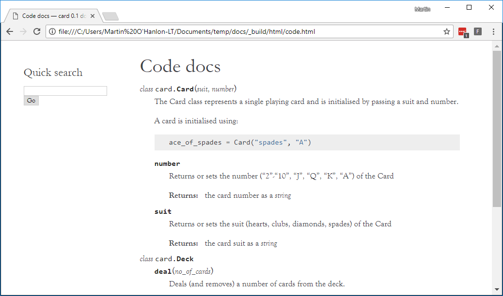

## Introduction

When you've created a really useful project and you want to share it with other people, a crucial step is creating documentation that helps people understand what the code does, how it works, and how they can use it.

To share the code you've created and help people use it, you will create a website that documents your project.

### What you will make

This guide will teach you how to build a website for your project that automatically creates documentation for your Python code.

### What you will learn

+ How to document Python code

+ How to automatically generate documentation

+ How to use the reStructuredText markup language

+ How to create a project website using Sphinx

This project covers elements from the following strands of the [Raspberry Pi Digital Making Curriculum](http://rpf.io/curriculum){:target="_blank"}:

+ [Support others in the design and build of their digital making projects](https://www.raspberrypi.org/curriculum/strand/developer){:target="_blank"}

### Additional information for educators

If you need to print this project, please use the [printer-friendly version](https://projects.raspberrypi.org/en/projects/documenting-your-code/print){:target="_blank"}.

Use the link in the footer to access the GitHub repository for this project, which contains all resources (including an example finished project) in the 'en/resources' folder.
