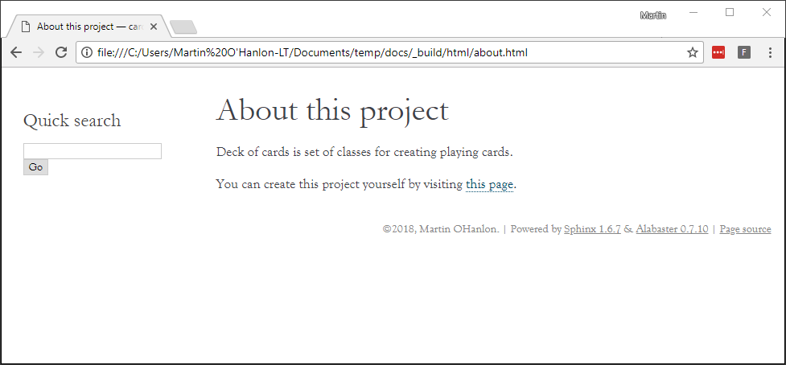

## Creating pages

As well as having pages that describe your code, you can include your own pages on the project website.

All pages need to be formatted using the ReST markup language. This [primer page](http://www.sphinx-doc.org/en/stable/rest.html) will show you how to use the most common ReST syntax elements.

To get started, let's create an About page that will display some details about the project and where to find more information.

--- task ---

Create a new file called `about.rst`.

--- /task ---

--- task ---

Add a title to the page:

```
About this project
==================
```

--- /task ---

--- task ---

Add some content about the project, for example:

```
Deck of cards is a set of classes for creating playing cards.
```

--- /task ---

--- task ---

Perhaps add a hyperlink to the project's source code:

```
You can create this project yourself by visiting `this page <https://projects.raspberrypi.org/en/projects/deck-of-cards>`_.
```

--- /task ---

--- collapse ---

---
title: URLs in ReST
---

The structure of the URL markup is very specific in ReST.

+ The text for the link and the URL itself need to be in between two back ticks, the second of which is followed by an underscore `_`, like this:

```
`link_text <url>`_
```

**Note:** it is important to put a space between the `link_text` and the `<url>`.

This type of markup is referred to as **in-line**, because it is within the text.

+ You can also create separate URL definitions and then refer to them anywhere within the text — this is useful if you want to link to the same URL twice.

```
Please visit the `raspberry pi`_.

.. _raspberry pi: http://raspberrypi.org/
```

--- /collapse ---

--- task ---

When you have finished creating your `about.rst` page, add it to the `index.rst` file.

```
Welcome to card's documentation!
================================

.. toctree::
   :maxdepth: 2
   :caption: Contents:

   about
   code
```

--- /task ---

--- task ---

Rebuild your project to see your new page.



--- /task ---

--- task ---

Add a second page to your project site, e.g. for FAQs.

--- /task ---
