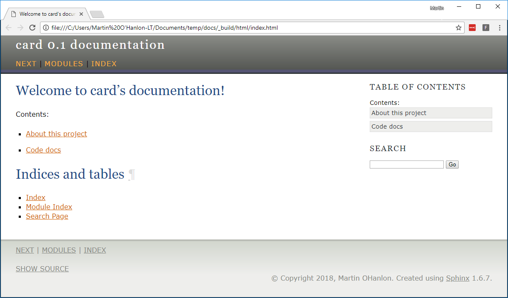

## What next

+ Investigate the different options [Sphinx](http://www.sphinx-doc.org) gives you to customise, such as [changing the theme](http://www.sphinx-doc.org/en/master/theming.html).

+ Document a project of your own by addings **docstrings** and creating a project website

+ Host your project website on [github](https://github.com) or [readthedocs](https://readthedocs.org/)