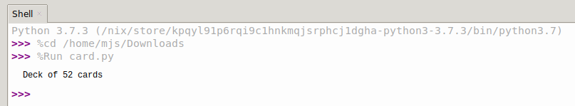

## Getting Started

Imagine you have created a software masterpiece which will make countless coders live's a little easier, its available, its brilliant, but nobody is using it because they  don't know how too!

A crucial step in sharing your code is creating documentation which helps people understand what it does, how it works and how to use it.

You will be documenting some example code based on the [deck of cards](https://projects.raspberrypi.org/en/projects/deck-of-cards){:target="_blank"} project. It is not essential you have completed the *deck of cards* project but it would be useful so you can understand what the code does.

--- task ---

Download the project code [card.py](resources/card.py)

--- /task ---

--- task ---

Open the downloaded `card.py` program using Python 3 IDLE

--- /task ---

--- task ---

Look over the code, you will see there are 2 classes, `Card` and `Deck`.

`Card` represents a single playing card, while `Deck` is a collection of `Cards` stacked in an order.

At the bottom of the program, a `deck` object is created from `Deck` and a description is printed to the screen.

--- /task ---

--- collapse ---

---
title: card.py
---

```python

import random

class Card:

    def __init__(self, suit, number):
        self._suit = suit
        self._number = number

    def __repr__(self):
        return self._number + " of " + self._suit

    @property
    def suit(self):
        return self._suit

    @suit.setter
    def suit(self, suit):
           if suit in ["hearts", "clubs", "diamonds", "spades"]:
               self._suit = suit
           else:
               print("That's not a suit!")

    @property
    def number(self):
        return self._number

    @number.setter
    def number(self, number):
        valid = [str(n) for n in range(2,11)] + ["J", "Q", "K", "A"]
        if number in valid:
            self._number = number
        else:
            print("That's not a valid number")


class Deck:

    def __init__(self):
        self._cards = []
        self.populate()

    def populate(self):
        suits = ["hearts", "clubs", "diamonds", "spades"]
        numbers = [str(n) for n in range(2,11)] + ["J", "Q", "K", "A"]
        self._cards = [ Card(s, n) for s in suits for n in numbers ]

    def shuffle(self):
        random.shuffle(self._cards)

    def deal(self, no_of_cards):
        dealt_cards = []
        for i in range(no_of_cards):
            dealt_card = self._cards.pop(0)
            dealt_cards.append(dealt_card)
        return dealt_cards

    def __repr__(self):
        cards_in_deck = len(self._cards)
        return "Deck of " + str(cards_in_deck) + " cards"
        
deck = Deck()
print(deck)

```

--- /collapse ---

--- task ---

Run the `card.py` program

You should see a message printed to the screen describing the deck of cards.



--- /task ---
