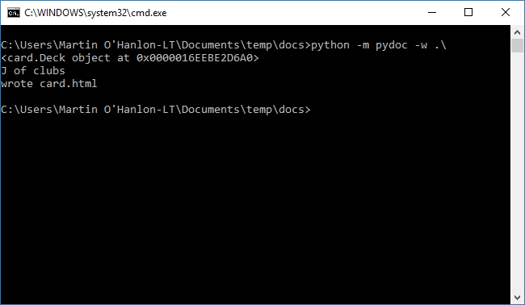
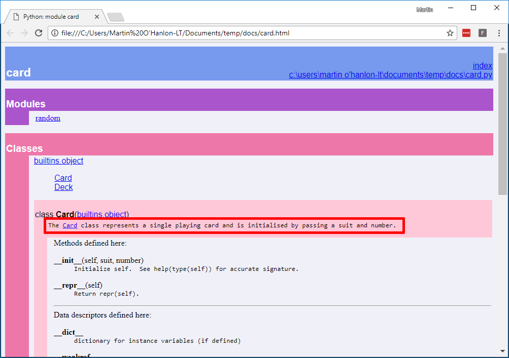

## Generating documentation

Now that your code contains some information about it in *docstrings* you can use Python's [pydoc](https://docs.python.org/3/library/pydoc.html) module to automatically create HTML documentation about your code.

--- task ---

Open a terminal (Mac/Linux) or command prompt (Windows)

--- /task ---

--- task ---

Navigate to the folder which contains your `card.py` program

--- /task ---

--- task ---

Enter the command to run the pydoc module and create the documentation

--- collapse ---

---
title: Windows
---

```bash
python -m pydoc -w .\card.py
```



If you get an error when you try this command, take a look at [using pip on windows](https://projects.raspberrypi.org/en/projects/using-pip-on-windows), and make sure you have added Python to your path.

--- /collapse ---

--- collapse ---

---
title: Linux / MacOS
---

```bash
python3 -m pydoc -w ./card.py
```


--- /collapse ---

You will be presented with the message `wrote card.html` when it completes.

--- /task ---

--- task ---

Open the `card.html` file using your web browser to see the documentation that has been created.

You will see a page which shows the `Card` and `Deck` classes, their methods and properties, including the descriptions you added as *docstrings*.



--- /task ---

This simple HTML page could be uploaded to a hosting service on the internet and provide your users with information about your software.