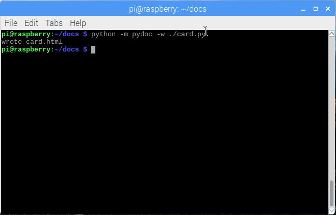

## Generating documentation

Now that your code contains some information about itself in the form of docstrings, you can use Python's [pydoc](https://docs.python.org/3/library/pydoc.html) module to automatically create HTML documentation about your code.

--- task ---

Open a terminal window (Raspberry Pi/Linux PC/Mac) or command prompt window (Windows PC).

--- /task ---

--- task ---

Navigate to the folder containing your `card.py` program.

```bash
cd name_of_folder
```

--- /task ---

--- task ---

Enter the command to run the `pydoc` module to create documentation.

--- collapse ---

---
title: Windows PC
---

```bash
python -m pydoc -w .\card.py
```


If you get an error when you run this command, take a look at our [Using pip on windows](https://projects.raspberrypi.org/en/projects/using-pip-on-windows) guide for help with installation, and make sure you've added Python to your path.

--- /collapse ---

--- collapse ---

---
title: Raspberry Pi/Linux PC/Mac
---

```bash
python3 -m pydoc -w ./card.py
```



--- /collapse ---

When the command has finished running, you will be presented with the message 'wrote card.html'. Note that `pydoc` uses the name of the Python program you input as the name for the HTML file.

--- /task ---

--- task ---

Open the `card.html` file using your web browser to see the documentation that's been created.

You will see a page that shows the `Card` and `Deck` classes, their methods, and properties, including the descriptions you added as docstrings.


--- /task ---

You could upload this basic HTML page to a hosting service to provide your users with information about your software. The next steps will show you how to use the Sphinx tool to build a documentation website to which you can add additional content and information.
