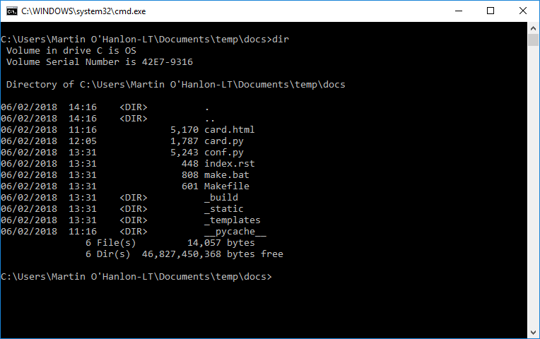
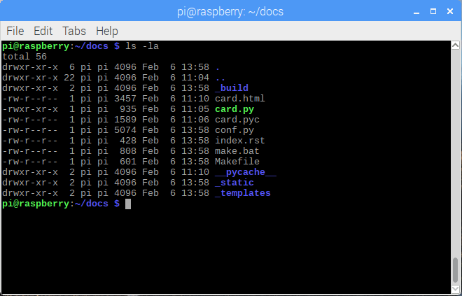

## Creating a project website with Sphinx

Using `pydoc` and docstrings is a great way to create structured documentation about your code, but it has limits because you can't add additional information and content.

On a less basic website, similar to e.g. the one for [GPIO Zero](https://gpiozero.readthedocs.io), you can add a lot more information in addition to documentation, such as recipes, FAQs, images, and code snippets.

You will use [Sphinx](http://www.sphinx-doc.org) to create such a project website. This tool was originally created for documenting the Python language.

To create content for your Sphinx website, you will write text files formatted using the simple but powerful markup language [reStructuredText(ReST)](http://docutils.sourceforge.net/rst.html).

### Install Sphinx

--- task ---

Open a terminal or command prompt window.

--- /task ---

--- task ---

Use `pip3` to install the `Sphinx` module.

[[[generic-python-installing-with-pip]]]

--- /task ---

### Create a Sphinx project site

Sphinx includes a quick-start utility that creates a template Sphinx project. 

--- task ---

Navigate to your project directory.

--- /task ---

--- task ---

Run the Sphinx quick-start utility by running:

```bash
sphinx-quickstart
```


--- /task ---

--- task ---

Use the following responses to complete the quick-start questionnaire that will determine properties and settings Sphinx will use for your website.

**Note:** There's a fair number of questions — you'll use the default answer for **all but four** of them by pressing <kbd>Enter</kbd>.


| Question | Use default | Response 
| - | - | - |
| Root path for the documentation [.] | Yes | . |
| Separate source and build directories (y/n) [n] | Yes | n |
| Name prefix for templates and static dir [_]: | Yes | _ |
| Project name:  | **No** | card |
| Author name(s): | **No** | your name |
| Project version []:| **No** | 0.1 |
| Project release [0.1]: | Yes | 0.1 |
| Project language [en]: | Yes | en |
| Source file suffix [.rst]: | Yes | .rst |
| Name of your master document (without suffix) [index]: | Yes | index |
| Do you want to use the epub builder (y/n) [n]: | Yes | n |
| autodoc: automatically insert docstrings from modules (y/n) [n]: | **No** | y |
| doctest: automatically test code snippets in doctest blocks (y/n) [n]: | Yes | n |
| intersphinx: link between Sphinx documentation of different projects (y/n) [n]: | Yes | n |
| todo: write "todo" entries that can be shown or hidden on build (y/n) [n]: | Yes | n |
| coverage: checks for documentation coverage (y/n) [n]: | Yes | n |
| imgmath: include math, rendered as PNG or SVG images (y/n) [n]: | Yes | n |
| mathjax: include math, rendered in the browser by MathJax (y/n) [n]: | Yes | n |
| ifconfig: conditional inclusion of content based on config values (y/n) [n]: | Yes | n |
| viewcode: include links to the source code of documented Python objects (y/n) [n]: | Yes | n |
| githubpages: create .nojekyll file to publish the document on GitHub pages (y/n) [n]: | Yes | n |
| Create Makefile? (y/n) [y]: | Yes | y |
| Create Windows command file? (y/n) [y]: | Yes | y |

--- /task ---

The Sphinx quick-start program will make a number of files and directorys where your documentation will be created.

--- collapse ---

---
title: Windows file structure
---



--- /collapse ---

--- collapse ---

---
title: Linux/macOS file structure
---



--- /collapse ---

The key files and directory are:

+ `conf.py` — a Sphinx configuration file that describes how your documentation should be created

+ `index.rst` — the **main** page and index of your documentation

+ `_build` — the directory where your documentation will be created

