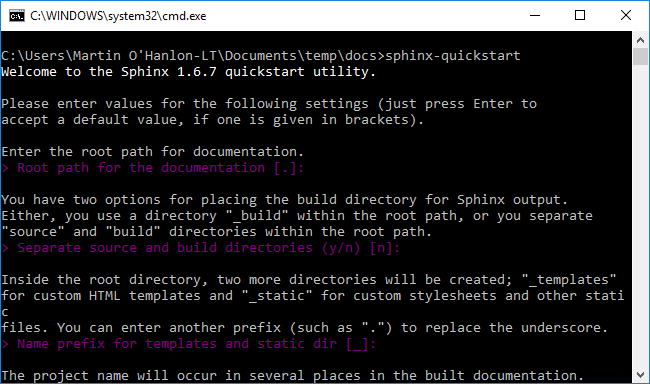
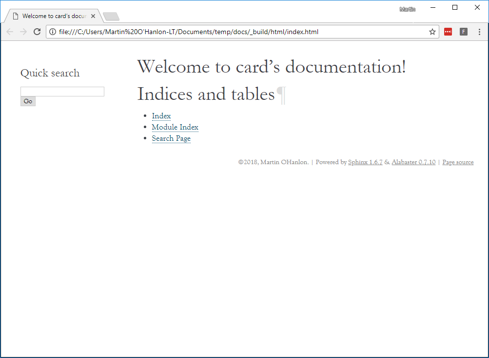

## Creating a Project website with Sphinx

Using pydoc and docstrings is a great way to create structured documentation about your code but it is limited and you cant add additional information and content.

By creating a website for your project, such as the one for [gpiozero](https://gpiozero.readthedocs.io), you can add a lot more information such as recipes, FAQ's, images and code snippets as well as a documentation about your code.

You will use [Sphinx](http://www.sphinx-doc.org) to make your project website which was originally created for documenting the Python language.

You create content for your Sphinx website by writing text files which are formatted using the [reStructuredText](http://docutils.sourceforge.net/rst.html) markup language.

### Install Sphinx

--- task ---

Open a command prompt

--- /task ---

--- task ---

Use `pip3` to install the `Sphinx` module

[[[generic-python-installing-with-pip]]]

--- /task ---

### Create a Sphinx project site

Sphinx includes a quick start utility which will create a template sphinx project. 

--- task ---

Navigate to your project directory

--- /task ---

--- task ---

Run the sphinx quick start utility

```bash
sphinx-quickstart
```



It will prompt you to answer a lot of questions, most of which can be left as the default by simple pressing Enter.

+ Complete the Sphinx quick start questionaire using the following responses:

| Question | Use Default | Response 
| - | - | - |
| Root path for the documentation [.] | Yes | . |
| Separate source and build directories (y/n) [n] | Yes | n |
| Name prefix for templates and static dir [_]: | Yes | _ |
| Project name:  | No | card |
| Author name(s): | No | your name |
| Project version []:| No | 0.1 |
| Project release [0.1]: | Yes | 0.1 |
| Project language [en]: | Yes | en |
| Source file suffix [.rst]: | Yes | .rst |
| Name of your master document (without suffix) [index]: | Yes | index |
| Do you want to use the epub builder (y/n) [n]: | Yes | n |
| autodoc: automatically insert docstrings from modules (y/n) [n]: | No | y |
| doctest: automatically test code snippets in doctest blocks (y/n) [n]: | Yes | n |
| intersphinx: link between Sphinx documentation of different projects (y/n) [n]: | Yes | n |
| todo: write "todo" entries that can be shown or hidden on build (y/n) [n]: | Yes | n |
| coverage: checks for documentation coverage (y/n) [n]: | Yes | n |
| imgmath: include math, rendered as PNG or SVG images (y/n) [n]: | Yes | n |
| mathjax: include math, rendered in the browser by MathJax (y/n) [n]: | Yes | n |
| ifconfig: conditional inclusion of content based on config values (y/n) [n]: | Yes | n |
| viewcode: include links to the source code of documented Python objects (y/n) [n]: | Yes | n |
| githubpages: create .nojekyll file to publish the document on GitHub pages (y/n) [n]: | Yes | n |
| Create Makefile? (y/n) [y]: | Yes | y |
| Create Windows command file? (y/n) [y]: | Yes | y |

--- /task ---

The sphinx quick start program will created a number of files and directory's which is where your documentation will be created.

--- collapse ---

---
title: Windows file structure
---


--- /collapse ---

--- collapse ---

---
title: Linux / MacOS file structure
---


--- /collapse ---

The key files & directory are:

+ conf.py - this is Sphinx configuration file which describes how your documentation should be created

+ index.rst - this is the *main* page and index of your documentation

+ _build - your documentation will be created in this directory

### Build your website

To view your project website, you will need to build it, this converts all the project files into HTML web pages.

+ Run the following command to build your website.

```bash
make html
```


This will create a `html` folder in the `_build` directory which will hold the project website.

+ Open the `index.html` file in the `_build/html` directory with a web browser.

You will see an empty project site.



Now you need add your own content to the project site, including auto generated documentation from your code.