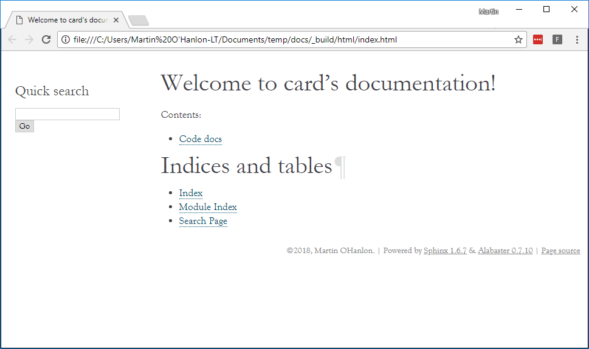
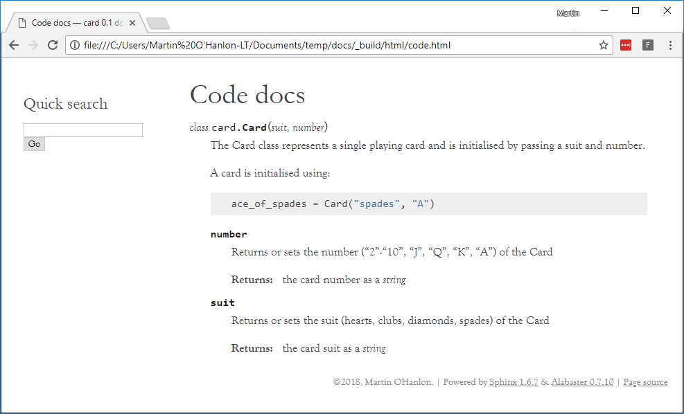

## Adding your code documentation

### Configure conf.py

To include the code documentation, Sphinx needs to know where to find it, you do this by modifying the `conf.py` file.

+ Open `conf.py`

+ Find this section of code.

```python
# import os
# import sys
# sys.path.insert(0, os.path.abspath('.'))
```

+ Uncomment the code by removing the `#` characters.

```python
import os
import sys
sys.path.insert(0, os.path.abspath('.'))
```

This adds the current directory `.` to Sphinx's configuration so it can find your code files.

### Add your code documentation

+ Create a new file called `code.rst` which will be your code documentation page.

+ Add a title to the page.

```
Code docs
=========
```

+ Add the following code to import the `card.py` module.

```
.. module:: card
```

+ Next add this code to automatically generate the documentation for the `Card` class.

```
.. autoclass:: Card
    :members:
```

In order for your `code.rst` page to appear on your project website, it needs to be added to the index.

+ Open `index.rst`.

+ Modify `index.rst`, to add the `code` page under the table of contents `..toctree::`, so the code looks like this:

```
Welcome to card's documentation!
================================

.. toctree::
   :maxdepth: 2
   :caption: Contents:

   code
```

+ Re-build your project website.

```bash
make html
```

+ Re-open the `index.html` file in the `_build/html` directory.

Your code page will now appear in the index.



When you open the code page you will see your auto-generated documentation about the code class.



+ Update `code.rst` to auto generate the documentation for the `Deck` class.

--- hints ---

--- hint ---

Repeat the step where you used `autoclass` to generate the docs for the `Card` class.

--- /hint ---

--- hint ---

You will need to add this code into `code.rst`:

```
.. autoclass:: Deck
    :members:
```

--- /hint ---

--- hint ---

The `code.rst` file should look like this:

```
Code docs
=========

.. module:: card

.. autoclass:: Card
    :members:

.. autoclass:: Deck
    :members:
```

--- /hint ---

--- /hints ---

+ Re-build your website and check the code page now includes documentation for `Card` and `Deck`.

