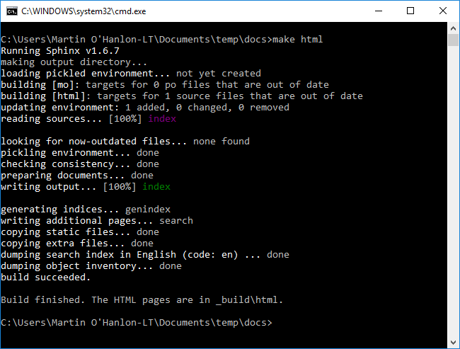
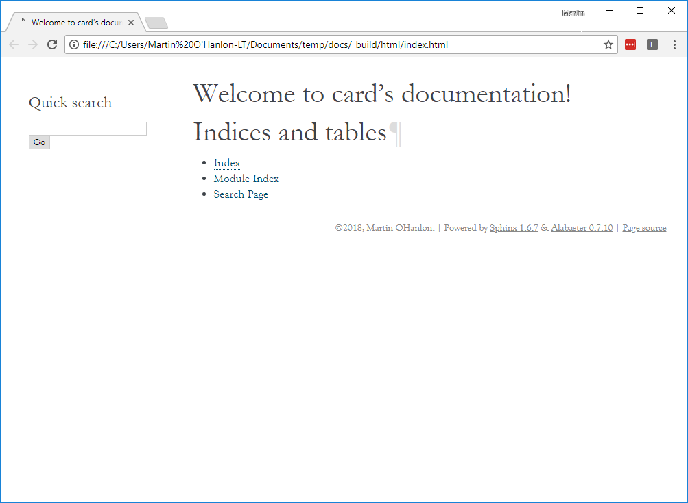

## Build your website

To view your project website, you will need to **build** it. This converts all the project files into HTML files.

--- task ---

+ Run the following command to build your website.

```bash
make html
```



This will create a `html` folder in the `_build` directory that will hold the project website files.

--- /task ---

--- task ---

+ Open the `index.html` file in the `_build/html` directory using a web browser.

You will see an empty project site:



--- /task ---

Next you'll add your own content to the project site, including auto-generated documentation for your code.
