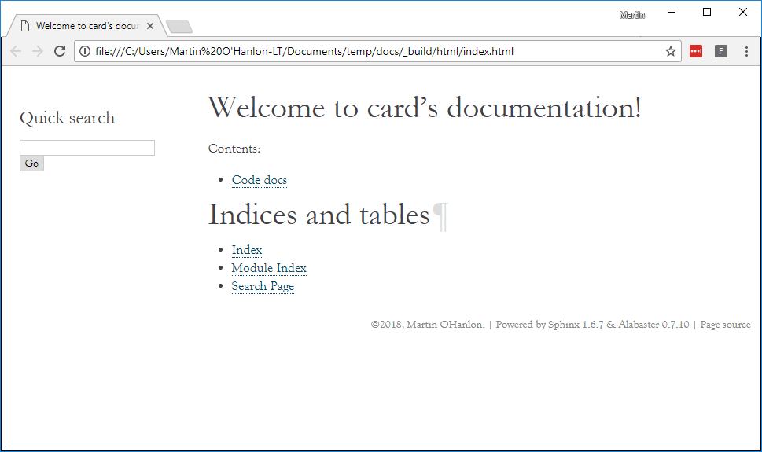
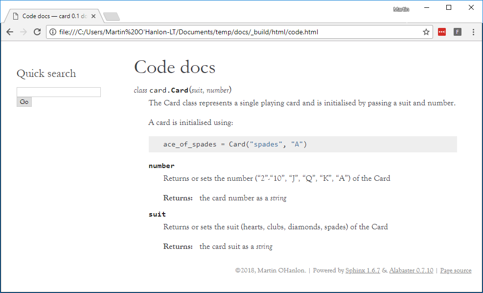
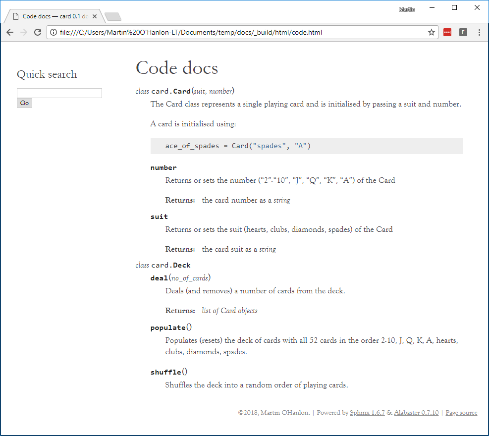

## Adding your code documentation

### Configure conf.py

So it can include the code documentation, Sphinx needs to know where to find it. You tell Sphinx this by modifying the `conf.py` file.

--- task ---

+ Open `conf.py`.

--- /task ---

--- task ---

+ Find this section of code:

```python
# import os
# import sys
# sys.path.insert(0, os.path.abspath('.'))
```

--- /task ---

--- task ---

+ Uncomment this code by removing the `#` characters.

```python
import os
import sys
sys.path.insert(0, os.path.abspath('.'))
```

--- /task ---

This adds the current directory `.` to Sphinx's configuration so it can find your code files.

### Add your code documentation

--- task ---

+ Create a new file called `code.rst`. This will be your code documentation page.

--- /task ---

--- task ---

+ Add a title to the page:

```
Code docs
=========
```

--- /task ---

--- task ---

+ Add the following code to import the `card.py` module.

```
.. module:: card
```

--- /task ---

--- task ---

+ Next, add this code to automatically generate the documentation for the `Card` class:

```
.. autoclass:: Card
    :members:
```

--- /task ---

In order for your `code.rst` page to appear on your project website, it needs to be added to the index.

--- task ---

+ Open `index.rst`.

--- /task ---

--- task ---

+ Modify `index.rst` to add the `code` page under the table of contents `..toctree::` — the code should look like this:

```
Welcome to card's documentation!
================================

.. toctree::
   :maxdepth: 2
   :caption: Contents:

   code
```

--- /task ---

--- task ---

+ Re-build your project website.

```bash
make html
```
--- /task ---

--- task ---

+ Re-open the `index.html` file in the `_build/html` directory using your browser.

--- /task ---

Your code page will now appear in the index.



When you open the code page, you will see your auto-generated documentation about the `Card` class.



--- task ---

+ Update `code.rst` to auto-generate the documentation for the `Deck` class.

--- hints ---

--- hint ---

+ Repeat the step where you used `autoclass` to generate the docs for the `Card` class.

--- /hint ---

--- hint ---

+ You will need to add this code into `code.rst`:

```
.. autoclass:: Deck
    :members:
```

--- /hint ---

--- hint ---

The `code.rst` file should look like this:

```
Code docs
=========

.. module:: card

.. autoclass:: Card
    :members:

.. autoclass:: Deck
    :members:
```

--- /hint ---

--- /hints ---

--- /task ---

--- task ---

+ Re-build your website and check that the code page now includes documentation for `Card` and `Deck`.



--- /task ---
